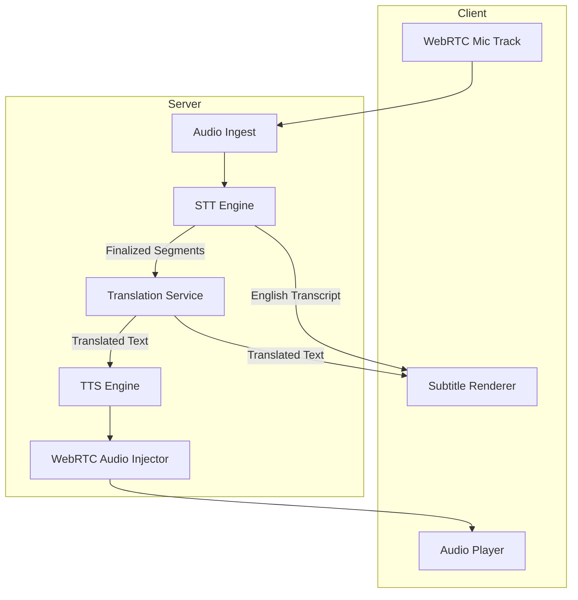

# PRD: Real-Time Multilingual Subtitles & Spoken Audio Translation

**Version:** 1.0  
**Date:** January 2025  
**Status:** Draft

---

## 1. Overview

This PRD defines the requirements for adding accessibility and multilingual communication features to a WebRTC-based real-time audio/video application.

The system supports:
- Live English subtitles
- Live translated subtitles (per viewer language)
- Optional live spoken audio translation (speech-to-speech)

The design prioritizes transcription accuracy, translation quality, and speaker clarity over cost and minimal latency.

---

## 2. Goals & Non-Goals

### Goals
- Highly accurate real-time speech recognition
- Natural, context-aware translations
- Clear speaker attribution
- Per-viewer language selection
- Seamless WebRTC integration
- Self-hosted by default, with paid upgrades allowed

### Non-Goals
- Perfect lip-sync dubbing
- Browser-only STT/TTS solutions
- Ultra-low latency at the expense of quality

---

## 3. User Stories

### Subtitles
- As a viewer, I want to see accurate English subtitles in real time.
- As a viewer, I want subtitles translated into my preferred language.
- As a host, I want to enable or disable captions per room.

### Spoken Translation
- As a viewer, I want to hear speakers translated into my language.
- As a viewer, I want to toggle original vs translated audio.
- As a host, I want to enable spoken translation for selected rooms.

---

## 4. Functional Requirements

### 4.1 Audio Capture
- Capture per-speaker WebRTC audio tracks.
- Forward audio to backend services for processing.
- Preserve speaker identity throughout the pipeline.

---

### 4.2 Live Subtitles (English)
- Perform streaming speech-to-text (STT).
- Emit:
  - Partial (interim) transcripts
  - Finalized transcript segments with timestamps
- Attribute subtitles to speakers.
- Display subtitles with minimal flicker.

---

### 4.3 Translated Subtitles
- Translate finalized English transcript segments.
- Support multiple viewer languages simultaneously.
- Cache translations per segment and language.
- Display translated subtitles based on viewer preference.

---

### 4.4 Live Spoken Audio Translation
- Convert finalized transcript segments into translated speech.
- Generate audio per viewer language.
- Inject translated audio as a WebRTC audio track.
- Allow viewer to:
  - Hear original audio only
  - Hear translated audio only
  - Hear both (original audio ducked)

---

## 5. System Architecture

### 5.1 Audio Processing Flow

```
WebRTC mic track
→ Server ingest
→ Streaming STT
→ Transcript segments
```

### 5.2 Subtitle Flow

```
Transcript (English)
→ Subtitle renderer
→ Optional translation → translated subtitles
```

### 5.3 Spoken Translation Flow

```
Transcript (English)
→ Translation
→ Text-to-Speech
→ WebRTC audio track → viewer
```

### 5.4 Architecture Diagram



---

## 6. Technology Choices

### 6.1 Speech-to-Text (STT)

#### Default (Self-Hosted)
- Whisper Large / Whisper.cpp
  - High accuracy
  - Multilingual support
  - Chunked streaming implementation

#### Optional Paid Engines
- Deepgram Streaming STT
- OpenAI Streaming STT
- Google Speech-to-Text

The STT engine must be configurable per deployment.

---

### 6.2 Translation

#### Preferred
- LLM-based translation for conversational accuracy

#### Alternatives
- MarianMT / NLLB (self-hosted)
- DeepL or Google Translate (paid)

Only finalized transcript segments are translated to avoid instability.

---

### 6.3 Text-to-Speech (TTS)

#### Default (Self-Hosted)
- Coqui TTS
- Piper
- XTTS

#### Optional Paid Engines
- ElevenLabs (high-quality multilingual voices)
- Google or Azure TTS

TTS must support streaming or chunked audio output.

---

## 7. Latency Targets

| Feature | Target Latency |
|---------|----------------|
| English subtitles | ≤ 500 ms |
| Translated subtitles | ≤ 800 ms |
| Spoken translation | ≤ 1.2 s |

Latency may increase slightly in favor of accuracy.

---

## 8. Data Model

### Transcript Segment

```json
{
  "segmentId": "uuid",
  "roomId": "uuid",
  "speakerId": "uuid",
  "startMs": 123456,
  "endMs": 124100,
  "text_en": "We need to ship this today.",
  "confidence": 0.94
}
```

### Translation

```json
{
  "segmentId": "uuid",
  "lang": "es",
  "text": "Tenemos que enviar esto hoy."
}
```

---

## 9. Audio Translation Model

- Each translated language is treated as a virtual participant.
- Audio is delivered via:
  - SFU forwarding, or
  - PeerConnection audio track injection
- Viewers subscribe only to selected language streams.

---

## 10. UI / UX Requirements

### Viewer Controls

- Subtitles:
  - Off
  - English
  - Auto-translate → language selector
- Audio Translation:
  - Off
  - Translated only
  - Original + translated

### Host Controls

- Enable subtitles
- Enable spoken translation
- Restrict available languages
- Display resource usage warnings

---

## 11. Scaling Considerations

- STT runs once per speaker.
- Translation runs once per segment per language.
- TTS runs once per language stream.
- Cache transcripts, translations, and audio segments.

---

## 12. Privacy & Compliance

- Audio is transient by default.
- Optional transcript storage per room.
- Clear user indication when captions or translation are enabled.

---

## 13. Configuration

```json
{
  "captionsEnabled": true,
  "spokenTranslationEnabled": false,
  "sttEngine": "whisper",
  "translationEngine": "llm",
  "ttsEngine": "coqui",
  "allowedLanguages": ["en", "es", "fr", "de"]
}
```

---

## 14. Success Metrics

- ≥95% perceived transcription accuracy
- ≥90% translation quality satisfaction
- Subtitle delay <1s perceived
- <2% session instability caused by translation features

---

## 15. Future Enhancements

- Speaker voice cloning
- Domain-specific vocabulary tuning
- Meeting recording with dubbed playback
- Caption search and export
- AI-generated meeting summaries

---

*Document Version: 1.0*
