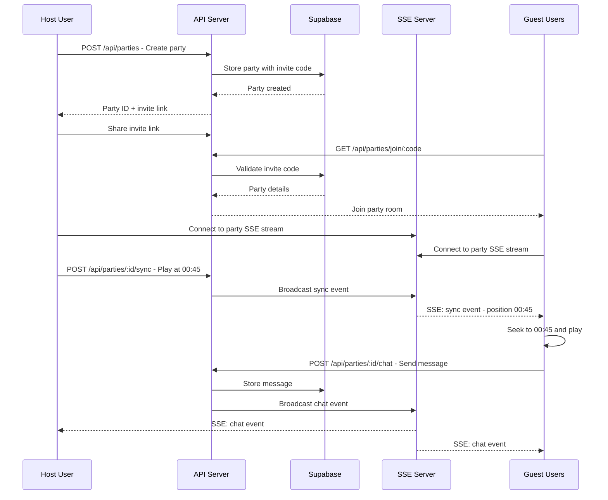
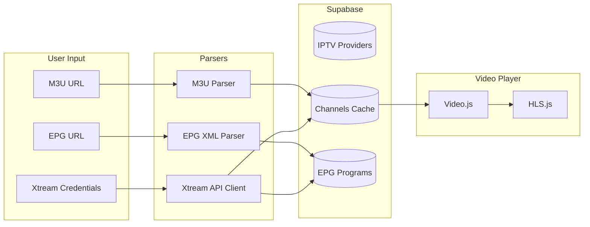
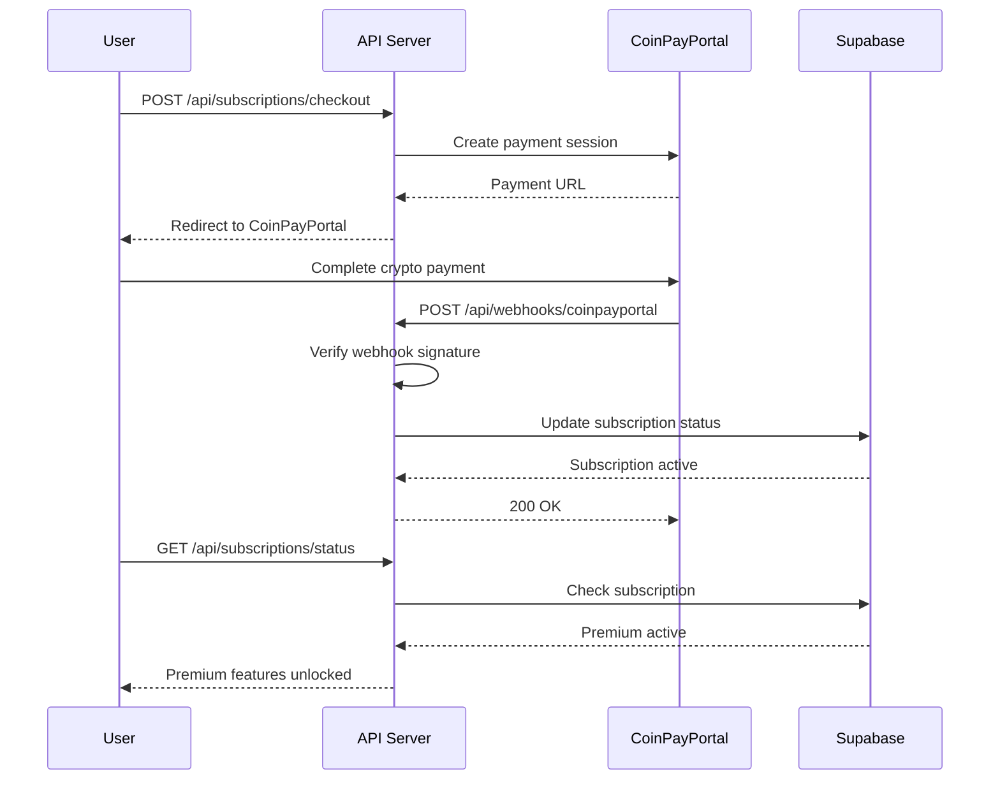

# BitTorrented.com - Expansion Plan

## Overview

Expanding the Media Torrent Platform into **BitTorrented.com** - a comprehensive multi-media streaming platform combining:
- **Torrent streaming** (existing) - Music, Movies, Ebooks from magnet URLs
- **IPTV streaming** (new) - M3U playlists, EPG guides, Xtream Codes
- **Watch parties** (new) - Synchronized viewing with real-time chat
- **Premium subscriptions** (new) - Crypto payments via CoinPayPortal

---

## System Architecture

```mermaid
flowchart TB
    subgraph Client [Browser Client]
        UI[Next.js UI - BitTorrented]
        VideoPlayer[Video.js + HLS.js Player]
        AudioPlayer[Audio Player]
        EbookReader[Ebook Reader]
        ChatWidget[SSE Chat Widget]
    end

    subgraph Server [DigitalOcean - Next.js Server]
        API[API Routes]
        
        subgraph TorrentServices [Torrent Services]
            MagnetService[Magnet Parser]
            MetadataService[WebTorrent Metadata]
            StreamService[Torrent Stream]
        end
        
        subgraph MediaServices [Media Services]
            FFmpegService[FFmpeg Transcoder]
            MetadataAPIs[Metadata Fetchers]
        end
        
        subgraph IPTVServices [IPTV Services]
            M3UParser[M3U Parser]
            EPGParser[EPG Parser]
            XtreamService[Xtream Codes API]
        end
        
        subgraph SocialServices [Social Services]
            WatchParty[Watch Party Sync]
            SSEChat[SSE Chat Server]
        end
        
        subgraph PaymentServices [Payment Services]
            CoinPayPortal[CoinPayPortal Integration]
            SubscriptionManager[Subscription Manager]
        end
    end

    subgraph Database [Supabase]
        PG[(PostgreSQL)]
        Auth[Supabase Auth]
    end

    subgraph ExternalAPIs [External APIs]
        MusicBrainz[MusicBrainz API]
        OpenLibrary[Open Library API]
        OMDb[OMDb API]
        TheTVDB[TheTVDB API]
        CoinPay[CoinPayPortal API]
    end

    subgraph TorrentNetwork [Torrent Network]
        DHT[DHT]
        Peers[Peers]
    end

    UI --> API
    VideoPlayer --> StreamService
    VideoPlayer --> M3UParser
    AudioPlayer --> StreamService
    EbookReader --> StreamService
    ChatWidget --> SSEChat
    
    API --> TorrentServices
    API --> MediaServices
    API --> IPTVServices
    API --> SocialServices
    API --> PaymentServices
    
    MetadataService --> DHT
    StreamService --> Peers
    
    MetadataAPIs --> MusicBrainz
    MetadataAPIs --> OpenLibrary
    MetadataAPIs --> OMDb
    MetadataAPIs --> TheTVDB
    
    CoinPayPortal --> CoinPay
    
    TorrentServices --> PG
    IPTVServices --> PG
    SocialServices --> PG
    PaymentServices --> PG
    API --> Auth
```



---

## Watch Party Architecture



---

## IPTV Flow



---

## Payment Flow



---

## Database Schema Additions

### IPTV Tables

```sql
-- M3U Playlist providers
CREATE TABLE iptv_providers (
    id UUID PRIMARY KEY DEFAULT gen_random_uuid(),
    user_id UUID REFERENCES auth.users(id) ON DELETE CASCADE,
    name TEXT NOT NULL,
    type VARCHAR(20) CHECK (type IN ('m3u', 'xtream')),
    -- M3U fields
    m3u_url TEXT,
    epg_url TEXT,
    -- Xtream fields
    xtream_url TEXT,
    xtream_username TEXT,
    xtream_password TEXT,
    -- Metadata
    channel_count INTEGER DEFAULT 0,
    last_synced_at TIMESTAMPTZ,
    created_at TIMESTAMPTZ DEFAULT NOW(),
    updated_at TIMESTAMPTZ DEFAULT NOW()
);

-- Cached channels from providers
CREATE TABLE iptv_channels (
    id UUID PRIMARY KEY DEFAULT gen_random_uuid(),
    provider_id UUID REFERENCES iptv_providers(id) ON DELETE CASCADE,
    channel_id TEXT NOT NULL,
    name TEXT NOT NULL,
    logo_url TEXT,
    group_title TEXT,
    stream_url TEXT NOT NULL,
    -- Search
    search_vector TSVECTOR GENERATED ALWAYS AS (
        to_tsvector('english', coalesce(name, '') || ' ' || coalesce(group_title, ''))
    ) STORED,
    created_at TIMESTAMPTZ DEFAULT NOW(),
    UNIQUE(provider_id, channel_id)
);

-- EPG program data
CREATE TABLE iptv_programs (
    id UUID PRIMARY KEY DEFAULT gen_random_uuid(),
    channel_id UUID REFERENCES iptv_channels(id) ON DELETE CASCADE,
    title TEXT NOT NULL,
    description TEXT,
    start_time TIMESTAMPTZ NOT NULL,
    end_time TIMESTAMPTZ NOT NULL,
    created_at TIMESTAMPTZ DEFAULT NOW()
);

CREATE INDEX idx_iptv_channels_search ON iptv_channels USING GIN(search_vector);
CREATE INDEX idx_iptv_programs_time ON iptv_programs(channel_id, start_time, end_time);
```

### Watch Party Tables

```sql
-- Watch parties
CREATE TABLE watch_parties (
    id UUID PRIMARY KEY DEFAULT gen_random_uuid(),
    host_id UUID REFERENCES auth.users(id) ON DELETE CASCADE,
    name TEXT NOT NULL,
    invite_code VARCHAR(12) UNIQUE NOT NULL,
    -- Content being watched
    content_type VARCHAR(20) CHECK (content_type IN ('torrent_file', 'iptv_channel')),
    torrent_file_id UUID REFERENCES torrent_files(id) ON DELETE SET NULL,
    iptv_channel_id UUID REFERENCES iptv_channels(id) ON DELETE SET NULL,
    -- Playback state
    is_playing BOOLEAN DEFAULT FALSE,
    current_position_seconds INTEGER DEFAULT 0,
    last_sync_at TIMESTAMPTZ DEFAULT NOW(),
    -- Status
    status VARCHAR(20) DEFAULT 'active' CHECK (status IN ('active', 'ended')),
    created_at TIMESTAMPTZ DEFAULT NOW(),
    ended_at TIMESTAMPTZ
);

-- Party participants
CREATE TABLE watch_party_participants (
    id UUID PRIMARY KEY DEFAULT gen_random_uuid(),
    party_id UUID REFERENCES watch_parties(id) ON DELETE CASCADE,
    user_id UUID REFERENCES auth.users(id) ON DELETE CASCADE,
    joined_at TIMESTAMPTZ DEFAULT NOW(),
    left_at TIMESTAMPTZ,
    UNIQUE(party_id, user_id)
);

-- Party chat messages
CREATE TABLE watch_party_messages (
    id UUID PRIMARY KEY DEFAULT gen_random_uuid(),
    party_id UUID REFERENCES watch_parties(id) ON DELETE CASCADE,
    user_id UUID REFERENCES auth.users(id) ON DELETE CASCADE,
    message TEXT NOT NULL,
    created_at TIMESTAMPTZ DEFAULT NOW()
);

CREATE INDEX idx_party_messages_party ON watch_party_messages(party_id, created_at);
```

### Subscription Tables

```sql
-- Subscription plans
CREATE TABLE subscription_plans (
    id UUID PRIMARY KEY DEFAULT gen_random_uuid(),
    name VARCHAR(50) NOT NULL,
    price_cents INTEGER NOT NULL,
    interval VARCHAR(20) CHECK (interval IN ('monthly', 'yearly')),
    max_family_members INTEGER DEFAULT 1,
    features JSONB DEFAULT '[]',
    is_active BOOLEAN DEFAULT TRUE,
    created_at TIMESTAMPTZ DEFAULT NOW()
);

-- User subscriptions
CREATE TABLE subscriptions (
    id UUID PRIMARY KEY DEFAULT gen_random_uuid(),
    user_id UUID REFERENCES auth.users(id) ON DELETE CASCADE,
    plan_id UUID REFERENCES subscription_plans(id),
    status VARCHAR(20) CHECK (status IN ('active', 'cancelled', 'expired', 'pending')),
    -- CoinPayPortal fields
    coinpay_payment_id TEXT,
    coinpay_subscription_id TEXT,
    -- Dates
    current_period_start TIMESTAMPTZ,
    current_period_end TIMESTAMPTZ,
    cancelled_at TIMESTAMPTZ,
    created_at TIMESTAMPTZ DEFAULT NOW(),
    updated_at TIMESTAMPTZ DEFAULT NOW()
);

-- Family plan members
CREATE TABLE family_members (
    id UUID PRIMARY KEY DEFAULT gen_random_uuid(),
    subscription_id UUID REFERENCES subscriptions(id) ON DELETE CASCADE,
    owner_id UUID REFERENCES auth.users(id) ON DELETE CASCADE,
    member_email TEXT NOT NULL,
    member_user_id UUID REFERENCES auth.users(id) ON DELETE SET NULL,
    invite_status VARCHAR(20) DEFAULT 'pending' CHECK (invite_status IN ('pending', 'accepted', 'declined')),
    invited_at TIMESTAMPTZ DEFAULT NOW(),
    accepted_at TIMESTAMPTZ,
    UNIQUE(subscription_id, member_email)
);

-- Insert default plans
INSERT INTO subscription_plans (name, price_cents, interval, max_family_members, features) VALUES
('Premium', 499, 'yearly', 1, '["ad_free", "hd_streaming", "watch_parties"]'),
('Family', 999, 'yearly', 10, '["ad_free", "hd_streaming", "watch_parties", "family_sharing"]');
```

### Media Metadata Tables

```sql
-- External metadata cache
CREATE TABLE external_metadata (
    id UUID PRIMARY KEY DEFAULT gen_random_uuid(),
    file_id UUID REFERENCES torrent_files(id) ON DELETE CASCADE,
    source VARCHAR(50) NOT NULL, -- musicbrainz, openlibrary, omdb, thetvdb
    external_id TEXT,
    metadata JSONB NOT NULL,
    fetched_at TIMESTAMPTZ DEFAULT NOW(),
    UNIQUE(file_id, source)
);
```

---

## API Contracts

### Watch Party APIs

```typescript
// POST /api/parties
interface CreatePartyRequest {
  name: string;
  contentType: 'torrent_file' | 'iptv_channel';
  torrentFileId?: string;
  iptvChannelId?: string;
}

interface CreatePartyResponse {
  id: string;
  inviteCode: string;
  inviteUrl: string;
}

// GET /api/parties/:id/stream - SSE endpoint
// Events: sync, chat, participant_joined, participant_left

// POST /api/parties/:id/sync
interface SyncRequest {
  isPlaying: boolean;
  positionSeconds: number;
}

// POST /api/parties/:id/chat
interface ChatRequest {
  message: string;
}
```

### IPTV APIs

```typescript
// POST /api/iptv/providers
interface CreateProviderRequest {
  name: string;
  type: 'm3u' | 'xtream';
  m3uUrl?: string;
  epgUrl?: string;
  xtreamUrl?: string;
  xtreamUsername?: string;
  xtreamPassword?: string;
}

// GET /api/iptv/providers/:id/channels?q=search&page=1
// GET /api/iptv/providers/:id/epg?channelId=X&date=2024-01-01
// GET /api/iptv/stream/:channelId - Proxy stream
```

### Subscription APIs

```typescript
// POST /api/subscriptions/checkout
interface CheckoutRequest {
  planId: string;
}

interface CheckoutResponse {
  paymentUrl: string;
  sessionId: string;
}

// POST /api/webhooks/coinpayportal
// Webhook from CoinPayPortal

// GET /api/subscriptions/status
interface SubscriptionStatus {
  isActive: boolean;
  plan?: string;
  expiresAt?: string;
  familyMembers?: FamilyMember[];
}

// POST /api/family/invite
interface InviteRequest {
  email: string;
}
```

### Metadata APIs

```typescript
// POST /api/metadata/fetch
interface FetchMetadataRequest {
  fileId: string;
  source: 'musicbrainz' | 'openlibrary' | 'omdb' | 'thetvdb';
}

// GET /api/metadata/:fileId
interface MetadataResponse {
  musicbrainz?: MusicBrainzMetadata;
  openlibrary?: OpenLibraryMetadata;
  omdb?: OMDbMetadata;
  thetvdb?: TheTVDBMetadata;
}
```

---

## Environment Variables

```env
# Existing
SUPABASE_URL=https://your-project.supabase.co
SUPABASE_SERVICE_ROLE_KEY=your-service-role-key
SUPABASE_ANON_KEY=your-anon-key

# Branding
NEXT_PUBLIC_APP_URL=https://bittorrented.com
NEXT_PUBLIC_APP_NAME=BitTorrented

# Metadata APIs
THETVDB_API_KEY=def21703-d637-4a11-9683-ea0e0fa29000
OMDB_API_KEY=c3bd0283
MUSICBRAINZ_USER_AGENT=BitTorrented/1.0.0 (https://bittorrented.com)

# CoinPayPortal
COINPAYPORTAL_MERCHANT_ID=158115fd-5462-4de3-9ef6-739b46031f61
COINPAYPORTAL_API_KEY=cp_live_8158b9eb8a12f6e3642c1454301377ba
COINPAYPORTAL_WEBHOOK_URL=https://bittorrented.com/api/webhooks/coinpayportal
COINPAYPORTAL_WEBHOOK_SECRET=NtwT6hEMeabgXy5d/azvLA==:HWFTjSQEmE1sGKXRKcIW9Q==:yiWfs+sJYJNrj58JeKjKxIy1nDjc+yfhgoxlAa+2GFO9Ox23wbiSymNrYWKNsGj0oz40SCP37q83w6L9Vr/OAw==

# Subscription Plans
PREMIUM_PLAN_PRICE_CENTS=499
FAMILY_PLAN_PRICE_CENTS=999
FAMILY_ADDITIONAL_SEAT_PRICE_CENTS=200
```

---

## Video Player Requirements

### Supported Formats (Browser Native)
- MP4 (H.264/AAC)
- WebM (VP8/VP9/Opus)
- OGG (Theora/Vorbis)

### Formats Requiring HLS.js
- M3U8 (HLS streams)
- MPEG-TS segments

### Formats Requiring Server Transcoding
- MKV → MP4/WebM (via FFmpeg)
- AVI → MP4/WebM (via FFmpeg)
- FLAC → OGG/MP3 (via FFmpeg)
- WMV → MP4/WebM (via FFmpeg)

### FFmpeg Transcoding Strategy
- **Optional feature** - User can toggle on/off in settings
- **On-demand transcoding** - No storage, stream directly
- **Segment-based** - Transcode in chunks for seeking
- **Quality options** - 480p, 720p, 1080p
- **Audio passthrough** when possible

### IPTV Proxy Strategy
- **Optional feature** - Toggle per provider in settings
- **Use case**: HTTP streams on HTTPS site cause mixed content errors
- **Proxy only manifest** - M3U8 playlist, not video segments (to save bandwidth)
- **URL rewriting** - Convert relative URLs to absolute

### Download Feature (Logged-in Users Only)
- **Single file download** - Download one file from a torrent via WebTorrent
- **Full torrent download** - Download entire torrent contents
- **Collection download** - Download all files in a playlist/collection
- **Progress tracking** - Show download progress in UI
- **Resume support** - Resume interrupted downloads
- **No server storage** - Files download directly to user's device via WebTorrent

---

## Chat Widget Design

```
┌─────────────────────────────────────┐
│ Watch Party Chat              [_][X]│
├─────────────────────────────────────┤
│ 👤 Alice: This scene is great!      │
│ 👤 Bob: I know right!               │
│ 👤 You: 🔥🔥🔥                       │
│                                     │
│                                     │
├─────────────────────────────────────┤
│ [Type a message...          ] [Send]│
└─────────────────────────────────────┘

Collapsed state (bottom-right):
┌─────┐
│ 💬 3│  <- Unread count badge
└─────┘
```

---

## Implementation Phases

### Phase 10: Rebrand to BitTorrented.com
- Update `NEXT_PUBLIC_APP_NAME` to "BitTorrented"
- Update `public/manifest.json` with new name and colors
- Update favicon and PWA icons
- Update page titles and meta tags
- Update README.md

### Phase 11: File Browser & Search UI
- File tree component with expand/collapse
- Unified search results showing torrents and files
- Filter by media type (audio/video/ebook)
- Sort options (name, size, date)

### Phase 12: Robust Video Player
- Install Video.js and HLS.js
- Create VideoPlayer component with controls
- Support native formats (MP4, WebM)
- Support HLS/M3U8 via HLS.js
- Fullscreen and picture-in-picture support
- Keyboard shortcuts

### Phase 13: Audio Player
- Persistent bottom bar player
- Queue management
- Shuffle and repeat modes
- Media Session API for lock screen controls

### Phase 14: FFmpeg Transcoding
- Install fluent-ffmpeg
- Create transcoding service
- On-demand MKV → MP4 transcoding
- Segment-based streaming for seeking
- No file storage - stream directly

### Phase 15: Metadata APIs
- MusicBrainz service for music metadata
- Open Library service for book metadata
- OMDb service for movie metadata
- TheTVDB service for TV show metadata
- Lazy-load metadata on file view

### Phase 16: Ebook Reader
- react-pdf for PDF files
- epub.js for EPUB files
- Page navigation and bookmarks
- Reading progress tracking

### Phase 17: Watch Party
- Create party with invite code
- SSE endpoint for real-time sync
- Playback sync (play/pause/seek)
- Collapsible chat widget
- POST for sending messages

### Phase 18: IPTV - M3U Support
- M3U parser service
- EPG XML parser
- Provider CRUD API
- Channel list with search
- EPG guide view

### Phase 19: Xtream Codes
- Xtream API client
- Provider CRUD with credentials
- Live streams list
- VOD support
- EPG from Xtream API

### Phase 20: Supabase Auth
- Sign up / Sign in pages
- Email verification
- Password reset
- Session management
- Protected routes

### Phase 21: CoinPayPortal Payments
- Checkout flow
- Webhook handler with signature verification
- Subscription status API
- Plan selection UI

### Phase 22: Family Plan
- Invite members by email
- Accept/decline invitations
- Member management UI
- Seat limit enforcement

### Phase 23: User Collections
- Favorites (all media types)
- Playlists (audio)
- Watchlists (video)
- Reading lists (ebooks)
- CRUD operations

### Phase 24: Progress Tracking
- Watch progress for videos
- Reading progress for ebooks
- Resume playback
- Continue watching/reading sections

### Phase 25: Rate Limiting
- Per-IP rate limits
- Per-user rate limits for authenticated
- Concurrent stream limits
- Abuse detection

### Phase 26: DigitalOcean Deployment
- Environment variables
- Health checks
- Auto-scaling configuration
- Domain setup for bittorrented.com

### Phase 27: CI/CD Pipeline
- GitHub Actions workflow
- Run all tests on PR
- Block merge if tests fail
- Auto-deploy on main merge

---

## Test Strategy

Each phase must include:
1. **Unit tests** for services
2. **Integration tests** for API routes
3. **Component tests** for UI (where applicable)

Key test areas:
- Watch party sync accuracy
- SSE message delivery
- M3U/EPG parsing edge cases
- Xtream API error handling
- Payment webhook verification
- Family member limits
- Transcoding output validation
