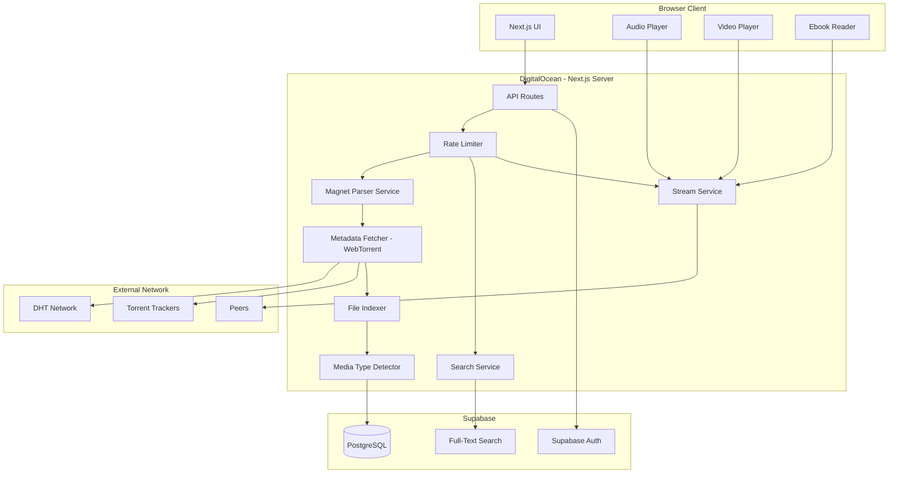
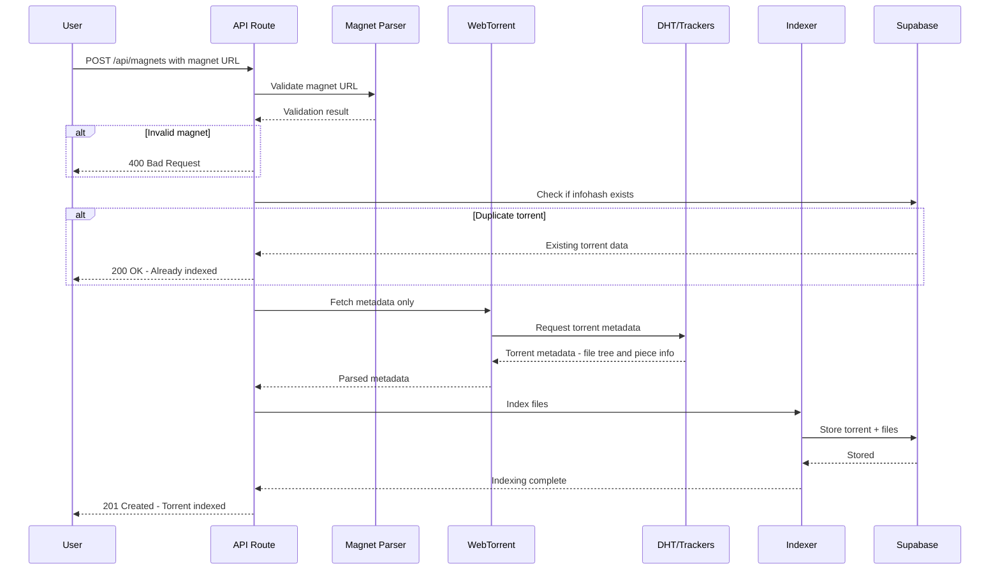
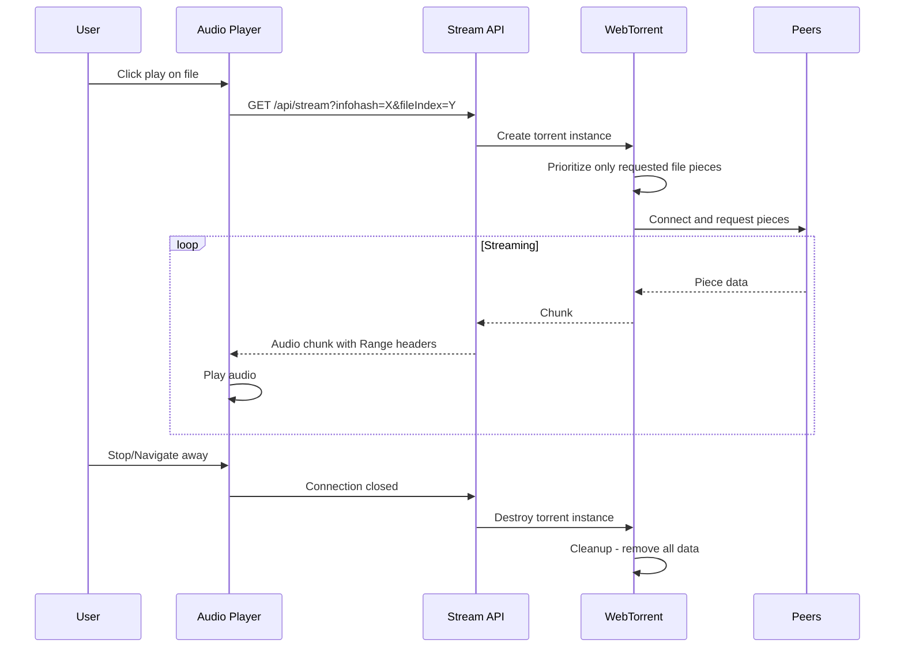

# Media Torrent Platform - Implementation Plan

## Overview

A **multi-media torrent-indexing and streaming platform** that allows users to submit magnet URLs and immediately search/stream files within torrents without downloading content until playback.

### Supported Media Types
- 🎵 **Music** - Audio streaming with player controls
- 🎬 **Movies/Video** - Video streaming with adaptive playback
- 📚 **Ebooks** - PDF/EPUB reader with in-browser viewing

### Tech Stack
- **Frontend**: Next.js 14+ (App Router), TypeScript, Tailwind CSS
- **Backend**: Next.js API Routes (Server-side only for Supabase)
- **Database**: Supabase (PostgreSQL with Full-Text Search)
- **Torrent**: WebTorrent (metadata-only fetching)
- **Testing**: Vitest with TDD approach
- **Deployment**: DigitalOcean App Platform
- **Auth**: Optional (Supabase Auth for saving favorites)
- **PWA**: next-pwa with offline support
- **UI Library**: Shadcn/ui + Radix primitives
- **Icons**: Lucide React
- **Animations**: Framer Motion
- **Video Player**: Video.js or Plyr
- **Ebook Reader**: react-pdf + epub.js

---

## System Architecture



### Supported File Types

| Category | Extensions | Streaming Method |
|----------|------------|------------------|
| **Audio** | mp3, flac, ogg, wav, aac, m4a | HTML5 Audio with Range |
| **Video** | mp4, mkv, avi, webm, mov | Video.js with HLS-like chunks |
| **Ebooks** | pdf, epub, mobi | In-browser reader |
| **Documents** | txt, md | Text viewer |

---

## Magnet Ingestion Flow



---

## Streaming Flow



---

## Supabase Schema Design

### Tables

```sql
-- Torrents table
CREATE TABLE torrents (
    id UUID PRIMARY KEY DEFAULT gen_random_uuid(),
    infohash VARCHAR(40) UNIQUE NOT NULL,
    magnet_uri TEXT NOT NULL,
    name TEXT NOT NULL,
    total_size BIGINT NOT NULL,
    file_count INTEGER NOT NULL,
    piece_length INTEGER NOT NULL,
    created_at TIMESTAMPTZ DEFAULT NOW(),
    updated_at TIMESTAMPTZ DEFAULT NOW()
);

-- Files table with full-text search
CREATE TABLE torrent_files (
    id UUID PRIMARY KEY DEFAULT gen_random_uuid(),
    torrent_id UUID REFERENCES torrents(id) ON DELETE CASCADE,
    file_index INTEGER NOT NULL,
    path TEXT NOT NULL,
    name TEXT NOT NULL,
    extension VARCHAR(20),
    size BIGINT NOT NULL,
    piece_start INTEGER NOT NULL,
    piece_end INTEGER NOT NULL,
    -- Media categorization
    media_category VARCHAR(20) CHECK (media_category IN ('audio', 'video', 'ebook', 'document', 'other')),
    mime_type VARCHAR(100),
    -- Full-text search vector
    search_vector TSVECTOR GENERATED ALWAYS AS (
        setweight(to_tsvector('english', coalesce(name, '')), 'A') ||
        setweight(to_tsvector('english', coalesce(path, '')), 'B')
    ) STORED,
    created_at TIMESTAMPTZ DEFAULT NOW(),
    UNIQUE(torrent_id, file_index)
);

-- Audio metadata - lazy loaded
CREATE TABLE audio_metadata (
    id UUID PRIMARY KEY DEFAULT gen_random_uuid(),
    file_id UUID REFERENCES torrent_files(id) ON DELETE CASCADE UNIQUE,
    artist TEXT,
    album TEXT,
    title TEXT,
    track_number INTEGER,
    duration_seconds INTEGER,
    bitrate INTEGER,
    sample_rate INTEGER,
    genre TEXT,
    year INTEGER,
    -- Full-text search vector
    search_vector TSVECTOR GENERATED ALWAYS AS (
        setweight(to_tsvector('english', coalesce(artist, '')), 'A') ||
        setweight(to_tsvector('english', coalesce(album, '')), 'B') ||
        setweight(to_tsvector('english', coalesce(title, '')), 'A') ||
        setweight(to_tsvector('english', coalesce(genre, '')), 'C')
    ) STORED,
    created_at TIMESTAMPTZ DEFAULT NOW()
);

-- Video metadata - lazy loaded
CREATE TABLE video_metadata (
    id UUID PRIMARY KEY DEFAULT gen_random_uuid(),
    file_id UUID REFERENCES torrent_files(id) ON DELETE CASCADE UNIQUE,
    title TEXT,
    duration_seconds INTEGER,
    width INTEGER,
    height INTEGER,
    codec VARCHAR(50),
    bitrate INTEGER,
    framerate DECIMAL(5,2),
    -- Full-text search vector
    search_vector TSVECTOR GENERATED ALWAYS AS (
        setweight(to_tsvector('english', coalesce(title, '')), 'A')
    ) STORED,
    created_at TIMESTAMPTZ DEFAULT NOW()
);

-- Ebook metadata - lazy loaded
CREATE TABLE ebook_metadata (
    id UUID PRIMARY KEY DEFAULT gen_random_uuid(),
    file_id UUID REFERENCES torrent_files(id) ON DELETE CASCADE UNIQUE,
    title TEXT,
    author TEXT,
    publisher TEXT,
    isbn VARCHAR(20),
    language VARCHAR(10),
    page_count INTEGER,
    year INTEGER,
    -- Full-text search vector
    search_vector TSVECTOR GENERATED ALWAYS AS (
        setweight(to_tsvector('english', coalesce(title, '')), 'A') ||
        setweight(to_tsvector('english', coalesce(author, '')), 'A') ||
        setweight(to_tsvector('english', coalesce(publisher, '')), 'B')
    ) STORED,
    created_at TIMESTAMPTZ DEFAULT NOW()
);

-- User favorites - optional auth feature
CREATE TABLE user_favorites (
    id UUID PRIMARY KEY DEFAULT gen_random_uuid(),
    user_id UUID REFERENCES auth.users(id) ON DELETE CASCADE,
    file_id UUID REFERENCES torrent_files(id) ON DELETE CASCADE,
    created_at TIMESTAMPTZ DEFAULT NOW(),
    UNIQUE(user_id, file_id)
);

-- User collections - playlists for music, watchlists for video, reading lists for ebooks
CREATE TABLE collections (
    id UUID PRIMARY KEY DEFAULT gen_random_uuid(),
    user_id UUID REFERENCES auth.users(id) ON DELETE CASCADE,
    name TEXT NOT NULL,
    collection_type VARCHAR(20) CHECK (collection_type IN ('playlist', 'watchlist', 'reading_list', 'mixed')),
    created_at TIMESTAMPTZ DEFAULT NOW(),
    updated_at TIMESTAMPTZ DEFAULT NOW()
);

CREATE TABLE collection_items (
    id UUID PRIMARY KEY DEFAULT gen_random_uuid(),
    collection_id UUID REFERENCES collections(id) ON DELETE CASCADE,
    file_id UUID REFERENCES torrent_files(id) ON DELETE CASCADE,
    position INTEGER NOT NULL,
    created_at TIMESTAMPTZ DEFAULT NOW(),
    UNIQUE(collection_id, file_id)
);

-- Reading progress for ebooks
CREATE TABLE reading_progress (
    id UUID PRIMARY KEY DEFAULT gen_random_uuid(),
    user_id UUID REFERENCES auth.users(id) ON DELETE CASCADE,
    file_id UUID REFERENCES torrent_files(id) ON DELETE CASCADE,
    current_page INTEGER DEFAULT 0,
    total_pages INTEGER,
    percentage DECIMAL(5,2) DEFAULT 0,
    last_read_at TIMESTAMPTZ DEFAULT NOW(),
    UNIQUE(user_id, file_id)
);

-- Watch progress for videos
CREATE TABLE watch_progress (
    id UUID PRIMARY KEY DEFAULT gen_random_uuid(),
    user_id UUID REFERENCES auth.users(id) ON DELETE CASCADE,
    file_id UUID REFERENCES torrent_files(id) ON DELETE CASCADE,
    current_time_seconds INTEGER DEFAULT 0,
    duration_seconds INTEGER,
    percentage DECIMAL(5,2) DEFAULT 0,
    last_watched_at TIMESTAMPTZ DEFAULT NOW(),
    UNIQUE(user_id, file_id)
);

-- Rate limiting table
CREATE TABLE rate_limits (
    id UUID PRIMARY KEY DEFAULT gen_random_uuid(),
    ip_address INET NOT NULL,
    action_type VARCHAR(50) NOT NULL,
    window_start TIMESTAMPTZ NOT NULL,
    request_count INTEGER DEFAULT 1,
    UNIQUE(ip_address, action_type, window_start)
);

-- Indexes for performance
CREATE INDEX idx_torrents_infohash ON torrents(infohash);
CREATE INDEX idx_torrent_files_torrent_id ON torrent_files(torrent_id);
CREATE INDEX idx_torrent_files_search ON torrent_files USING GIN(search_vector);
CREATE INDEX idx_torrent_files_category ON torrent_files(media_category);
CREATE INDEX idx_torrent_files_extension ON torrent_files(extension);
CREATE INDEX idx_audio_metadata_search ON audio_metadata USING GIN(search_vector);
CREATE INDEX idx_video_metadata_search ON video_metadata USING GIN(search_vector);
CREATE INDEX idx_ebook_metadata_search ON ebook_metadata USING GIN(search_vector);
CREATE INDEX idx_rate_limits_lookup ON rate_limits(ip_address, action_type, window_start);
```

---

## API Contracts

### Magnet Ingestion

```typescript
// POST /api/magnets
interface MagnetIngestRequest {
  magnetUri: string;
}

interface MagnetIngestResponse {
  success: boolean;
  torrent?: {
    id: string;
    infohash: string;
    name: string;
    totalSize: number;
    fileCount: number;
  };
  error?: string;
  alreadyExists?: boolean;
}
```

### Search

```typescript
// GET /api/search?q=query&type=all|torrent|file&page=1&limit=20
interface SearchRequest {
  q: string;
  type?: 'all' | 'torrent' | 'file';
  page?: number;
  limit?: number;
  torrentId?: string; // scope to single torrent
}

interface SearchResponse {
  results: SearchResult[];
  pagination: {
    page: number;
    limit: number;
    total: number;
    hasMore: boolean;
  };
}

interface SearchResult {
  type: 'torrent' | 'file';
  torrent: {
    id: string;
    infohash: string;
    name: string;
  };
  file?: {
    id: string;
    path: string;
    name: string;
    size: number;
    fileType: string;
    fileIndex: number;
  };
  metadata?: {
    artist?: string;
    album?: string;
    title?: string;
  };
}
```

### Streaming

```typescript
// GET /api/stream?infohash=X&fileIndex=Y
// Returns audio stream with Range header support

// Response headers:
// Content-Type: audio/mpeg | audio/flac | audio/ogg | etc
// Content-Length: file size
// Accept-Ranges: bytes
// Content-Range: bytes start-end/total
```

### Torrents

```typescript
// GET /api/torrents
interface TorrentsListResponse {
  torrents: Torrent[];
  pagination: Pagination;
}

// GET /api/torrents/:id
interface TorrentDetailResponse {
  torrent: Torrent;
  files: TorrentFile[];
}

// DELETE /api/torrents/:id
interface DeleteTorrentResponse {
  success: boolean;
}
```

---

## UI/UX Design Specification

### Design Philosophy
A **premium, dark-mode-first** multi-media streaming experience inspired by Spotify, Netflix, and Kindle - unified into a single decentralized platform.

### Color Palette - Dark Mode

```css
:root {
  /* Background layers */
  --bg-primary: #0a0a0b;      /* Main background - near black */
  --bg-secondary: #141416;    /* Cards, panels */
  --bg-tertiary: #1c1c1f;     /* Elevated elements */
  --bg-hover: #252528;        /* Hover states */
  
  /* Accent colors */
  --accent-primary: #8b5cf6;  /* Purple - primary actions */
  --accent-secondary: #06b6d4; /* Cyan - secondary highlights */
  --accent-gradient: linear-gradient(135deg, #8b5cf6 0%, #06b6d4 100%);
  
  /* Media type accents */
  --accent-audio: #22c55e;    /* Green for music */
  --accent-video: #ef4444;    /* Red for video */
  --accent-ebook: #f59e0b;    /* Amber for ebooks */
  
  /* Text */
  --text-primary: #fafafa;    /* Primary text */
  --text-secondary: #a1a1aa;  /* Secondary text */
  --text-muted: #71717a;      /* Muted/disabled */
  
  /* Semantic */
  --success: #22c55e;
  --warning: #f59e0b;
  --error: #ef4444;
  
  /* Borders */
  --border-subtle: #27272a;
  --border-default: #3f3f46;
}
```

### Typography

```css
/* Font stack */
font-family: 'Inter', -apple-system, BlinkMacSystemFont, 'Segoe UI', sans-serif;

/* Scale */
--text-xs: 0.75rem;    /* 12px - labels */
--text-sm: 0.875rem;   /* 14px - secondary */
--text-base: 1rem;     /* 16px - body */
--text-lg: 1.125rem;   /* 18px - emphasis */
--text-xl: 1.25rem;    /* 20px - headings */
--text-2xl: 1.5rem;    /* 24px - section titles */
--text-3xl: 1.875rem;  /* 30px - page titles */
--text-4xl: 2.25rem;   /* 36px - hero */
```

### Responsive Breakpoints - Mobile First

```css
sm: 640px   /* Large phones */
md: 768px   /* Tablets - switch to sidebar nav */
lg: 1024px  /* Laptops */
xl: 1280px  /* Desktops */
2xl: 1536px /* Large screens */
```

### Navigation Structure

```
Mobile - Bottom Tab Bar:
┌─────────────────────────────────────┐
│                                     │
│           [Content Area]            │
│                                     │
├─────────────────────────────────────┤
│  🏠    🔍    ➕    📚    👤        │
│ Home Search Add  Library Profile    │
└─────────────────────────────────────┘

Desktop - Sidebar:
┌────────┬────────────────────────────┐
│ 🎬     │                            │
│ Logo   │      [Content Area]        │
│        │                            │
│ 🏠 Home│                            │
│ 🔍 Search                           │
│ ➕ Add  │                            │
│        │                            │
│────────│                            │
│ Library│                            │
│ 🎵 Music                            │
│ 🎬 Movies                           │
│ 📚 Books                            │
│        │                            │
│────────│                            │
│ Collections                         │
│ • Favorites                         │
│ • Playlists                         │
│ • Watchlist                         │
│ • Reading                           │
└────────┴────────────────────────────┘
```

### Home Page - Media Hub

```
┌─────────────────────────────────────────────────────────────┐
│ 🔍 Search music, movies, books...                           │
├─────────────────────────────────────────────────────────────┤
│                                                             │
│ Continue Watching                                    See All│
│ ┌─────────┐ ┌─────────┐ ┌─────────┐ ┌─────────┐            │
│ │ 🎬      │ │ 🎬      │ │ 🎬      │ │ 🎬      │            │
│ │ ━━━━━━━ │ │ ━━━━━━━ │ │ ━━━━━━━ │ │ ━━━━━━━ │            │
│ │ 45%     │ │ 72%     │ │ 23%     │ │ 89%     │            │
│ └─────────┘ └─────────┘ └─────────┘ └─────────┘            │
│                                                             │
│ Recently Added Music                                 See All│
│ ┌─────────┐ ┌─────────┐ ┌─────────┐ ┌─────────┐            │
│ │ 🎵      │ │ 🎵      │ │ 🎵      │ │ 🎵      │            │
│ │ Album   │ │ Album   │ │ Album   │ │ Album   │            │
│ │ Artist  │ │ Artist  │ │ Artist  │ │ Artist  │            │
│ └─────────┘ └─────────┘ └─────────┘ └─────────┘            │
│                                                             │
│ Reading List                                         See All│
│ ┌─────────┐ ┌─────────┐ ┌─────────┐ ┌─────────┐            │
│ │ 📚      │ │ 📚      │ │ 📚      │ │ 📚      │            │
│ │ Title   │ │ Title   │ │ Title   │ │ Title   │            │
│ │ Author  │ │ Author  │ │ Author  │ │ Author  │            │
│ └─────────┘ └─────────┘ └─────────┘ └─────────┘            │
└─────────────────────────────────────────────────────────────┘
```

### Media Players

#### Audio Player - Persistent Bottom Bar
```
Mobile:
┌─────────────────────────────────────┐
│ [Art] Track Name          ▶️  ❤️   │
│       Artist Name         ━━━━━━━━  │
└─────────────────────────────────────┘

Desktop - Expanded:
┌─────────────────────────────────────────────────────────────┐
│ [Album Art]  Track Name - Artist        ⏮️ ▶️ ⏭️  🔀 🔁    │
│              Album Name                 ━━━━●━━━━━━━━━━━━━━  │
│                                         0:45 / 3:22   🔊━━━ │
└─────────────────────────────────────────────────────────────┘
```

#### Video Player - Fullscreen Capable
```
┌─────────────────────────────────────────────────────────────┐
│                                                             │
│                    [Video Content]                          │
│                                                             │
├─────────────────────────────────────────────────────────────┤
│ ▶️  0:45:23 ━━━━━━━━━━●━━━━━━━━━━━━━━━━━━━━━━━━━ 1:45:00   │
│ ⏮️ 10s   ▶️   ⏭️ 10s        🔊━━━   ⚙️   📺   ⛶           │
└─────────────────────────────────────────────────────────────┘
```

#### Ebook Reader - Immersive
```
┌─────────────────────────────────────────────────────────────┐
│ ← Back    Chapter 5: The Beginning           ⚙️  📑  🔖    │
├─────────────────────────────────────────────────────────────┤
│                                                             │
│    Lorem ipsum dolor sit amet, consectetur adipiscing       │
│    elit. Sed do eiusmod tempor incididunt ut labore.        │
│                                                             │
├─────────────────────────────────────────────────────────────┤
│ ◀️                    Page 127 of 342                    ▶️ │
│                         ━━━━●━━━━━━━━━━━━━━━━━━━━━━━━━━━━━  │
└─────────────────────────────────────────────────────────────┘
```

### PWA Configuration

```json
{
  "name": "Media Torrent",
  "short_name": "MediaTorrent",
  "description": "Stream music, movies, and books from torrents",
  "start_url": "/",
  "display": "standalone",
  "background_color": "#0a0a0b",
  "theme_color": "#8b5cf6",
  "orientation": "any",
  "icons": [
    { "src": "/icons/icon-192.png", "sizes": "192x192", "type": "image/png" },
    { "src": "/icons/icon-512.png", "sizes": "512x512", "type": "image/png" },
    { "src": "/icons/icon-maskable.png", "sizes": "512x512", "type": "image/png", "purpose": "maskable" }
  ]
}
```

### PWA Features

- **Offline Support**: Cache UI shell, search results, and metadata
- **Install Prompt**: Custom install banner with app benefits
- **Background Audio**: Continue music playback when app is backgrounded
- **Media Session API**: Lock screen controls for audio/video on mobile
- **Picture-in-Picture**: Video continues in floating window
- **Share Target**: Accept shared magnet links from other apps

### Accessibility

- **WCAG 2.1 AA** compliance target
- Keyboard navigation throughout
- Focus indicators on all interactive elements
- Screen reader announcements for player state
- Reduced motion support via `prefers-reduced-motion`
- Minimum touch target size: 44x44px
- High contrast mode support

### Animations - Framer Motion

```typescript
const fadeIn = {
  initial: { opacity: 0, y: 10 },
  animate: { opacity: 1, y: 0 },
  exit: { opacity: 0, y: -10 }
};

const scaleOnHover = {
  whileHover: { scale: 1.02 },
  whileTap: { scale: 0.98 }
};

const playerSlide = {
  initial: { y: 100 },
  animate: { y: 0 },
  transition: { type: 'spring', damping: 25 }
};
```

### Loading States

- **Skeleton loaders**: Search results, file tree, media cards
- **Spinner**: Magnet ingestion, stream buffering
- **Progress bar**: Metadata fetch, playback position, reading progress

---

## Project Structure

```
media-torrent/
├── src/
│   ├── app/                      # Next.js App Router
│   │   ├── layout.tsx
│   │   ├── page.tsx              # Home - search + torrent list
│   │   ├── torrents/
│   │   │   ├── page.tsx          # Torrent catalog
│   │   │   └── [id]/
│   │   │       └── page.tsx      # Torrent detail + file browser
│   │   └── api/
│   │       ├── magnets/
│   │       │   └── route.ts      # Magnet ingestion
│   │       ├── torrents/
│   │       │   ├── route.ts      # List torrents
│   │       │   └── [id]/
│   │       │       └── route.ts  # Torrent detail/delete
│   │       ├── search/
│   │       │   └── route.ts      # Deep file search
│   │       └── stream/
│   │           └── route.ts      # Audio streaming
│   ├── components/
│   │   ├── ui/                   # Shadcn/ui components
│   │   ├── MagnetInput.tsx
│   │   ├── TorrentList.tsx
│   │   ├── TorrentCard.tsx
│   │   ├── FileTree.tsx
│   │   ├── SearchBar.tsx
│   │   ├── SearchResults.tsx
│   │   ├── AudioPlayer.tsx
│   │   └── StreamButton.tsx
│   ├── lib/
│   │   ├── supabase/
│   │   │   ├── client.ts         # Server-side Supabase client
│   │   │   ├── queries.ts        # Database queries
│   │   │   └── types.ts          # Generated types
│   │   ├── torrent/
│   │   │   ├── magnet-parser.ts  # Magnet URL parsing
│   │   │   ├── metadata-fetcher.ts # WebTorrent metadata
│   │   │   ├── file-indexer.ts   # File indexing logic
│   │   │   └── stream-manager.ts # Streaming with cleanup
│   │   ├── search/
│   │   │   └── search-service.ts # Full-text search
│   │   └── rate-limit/
│   │       └── rate-limiter.ts   # Rate limiting logic
│   ├── hooks/
│   │   ├── useSearch.ts
│   │   ├── useTorrents.ts
│   │   └── useAudioPlayer.ts
│   └── types/
│       └── index.ts              # Shared types
├── tests/
│   ├── unit/
│   │   ├── magnet-parser.test.ts
│   │   ├── metadata-fetcher.test.ts
│   │   ├── file-indexer.test.ts
│   │   ├── search-service.test.ts
│   │   ├── stream-manager.test.ts
│   │   └── rate-limiter.test.ts
│   ├── integration/
│   │   ├── magnet-ingestion.test.ts
│   │   ├── search-api.test.ts
│   │   └── stream-api.test.ts
│   └── e2e/
│       └── user-flows.test.ts
├── supabase/
│   └── migrations/
│       └── 001_initial_schema.sql
├── .env.example
├── .env.local
├── vitest.config.ts
├── tailwind.config.ts
├── next.config.js
└── package.json
```

---

## TDD Test Strategy

### Red-Green-Refactor Cycle

For each feature:
1. **RED**: Write failing tests first
2. **GREEN**: Write minimal code to pass
3. **REFACTOR**: Clean up while keeping tests green

### Test Categories

#### Unit Tests - Magnet Parser
```typescript
describe('MagnetParser', () => {
  it('should parse valid magnet URL and extract infohash')
  it('should reject invalid magnet URL format')
  it('should reject magnet without infohash')
  it('should extract display name from magnet')
  it('should extract trackers from magnet')
  it('should handle URL-encoded characters')
})
```

#### Unit Tests - Metadata Fetcher
```typescript
describe('MetadataFetcher', () => {
  it('should fetch metadata without downloading file content')
  it('should timeout after configured duration')
  it('should handle tracker failures gracefully')
  it('should parse file tree correctly')
  it('should calculate piece mappings for each file')
  it('should handle torrents with thousands of files')
})
```

#### Unit Tests - Search Service
```typescript
describe('SearchService', () => {
  it('should find files by exact name match')
  it('should find files by partial name match')
  it('should perform case-insensitive search')
  it('should search across file paths')
  it('should search torrent names')
  it('should paginate results correctly')
  it('should scope search to single torrent')
  it('should prevent SQL injection')
  it('should return results under 150ms for large datasets')
})
```

#### Unit Tests - Stream Manager
```typescript
describe('StreamManager', () => {
  it('should prioritize only requested file pieces')
  it('should support range requests for seeking')
  it('should cleanup torrent after stream ends')
  it('should handle concurrent streams independently')
  it('should not download other files in torrent')
})
```

#### Unit Tests - Rate Limiter
```typescript
describe('RateLimiter', () => {
  it('should allow requests under limit')
  it('should block requests over limit')
  it('should reset after window expires')
  it('should track different action types separately')
})
```

#### Integration Tests
```typescript
describe('Magnet Ingestion API', () => {
  it('should ingest valid magnet and return torrent data')
  it('should deduplicate by infohash')
  it('should reject invalid magnets with 400')
  it('should rate limit excessive requests')
})

describe('Search API', () => {
  it('should return matching files across torrents')
  it('should include torrent context in results')
  it('should paginate large result sets')
})

describe('Stream API', () => {
  it('should stream audio with correct content type')
  it('should support range requests')
  it('should cleanup after client disconnects')
})
```

---

## Rate Limiting Strategy

| Action | Limit | Window |
|--------|-------|--------|
| Magnet ingestion | 10 | per minute |
| Search queries | 60 | per minute |
| Stream creation | 5 | concurrent |
| Stream bandwidth | 10 MB/s | per stream |

---

## DigitalOcean Deployment

See [docs/deployment-digitalocean.md](../docs/deployment-digitalocean.md) for detailed deployment instructions.

### Environment Variables
```
NEXT_PUBLIC_SUPABASE_URL=
SUPABASE_SERVICE_ROLE_KEY=
SUPABASE_ANON_KEY=
METADATA_FETCH_TIMEOUT=30000
MAX_CONCURRENT_STREAMS=100
RATE_LIMIT_ENABLED=true
```

---

## Definition of Done Checklist

For each feature:
- [ ] Red tests written first
- [ ] All tests passing
- [ ] Metadata-only ingestion verified (no content download)
- [ ] File-level search tested
- [ ] Streaming tested from search results
- [ ] Cleanup verified (no disk growth)
- [ ] Rate limiting applied
- [ ] Error handling complete
- [ ] TypeScript types complete
- [ ] Code reviewed

---

## Implementation Order

The phases are ordered to build foundational services first, then layer features on top:

1. **Project Scaffold** - Base Next.js + testing setup
2. **Supabase Schema** - Database foundation
3. **Magnet Parser** - Input validation (TDD)
4. **Metadata Fetcher** - Core torrent capability (TDD)
5. **File Indexer** - Storage layer (TDD)
6. **Search Service** - Query capability (TDD)
7. **Stream Service** - Playback capability (TDD)
8. **Torrent UI** - User-facing catalog
9. **File Browser UI** - Navigation
10. **Audio Player** - Playback UI
11. **Auth** - Optional user features
12. **Rate Limiting** - Protection
13. **DigitalOcean Config** - Deployment
14. **CI/CD** - Automation

Each phase builds on the previous, with TDD ensuring correctness at every step.
