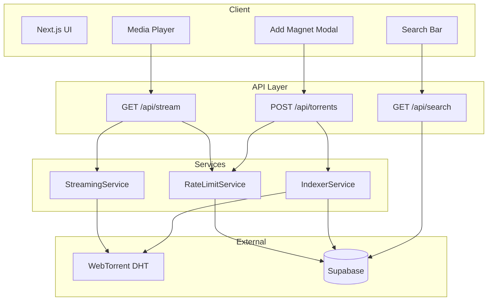
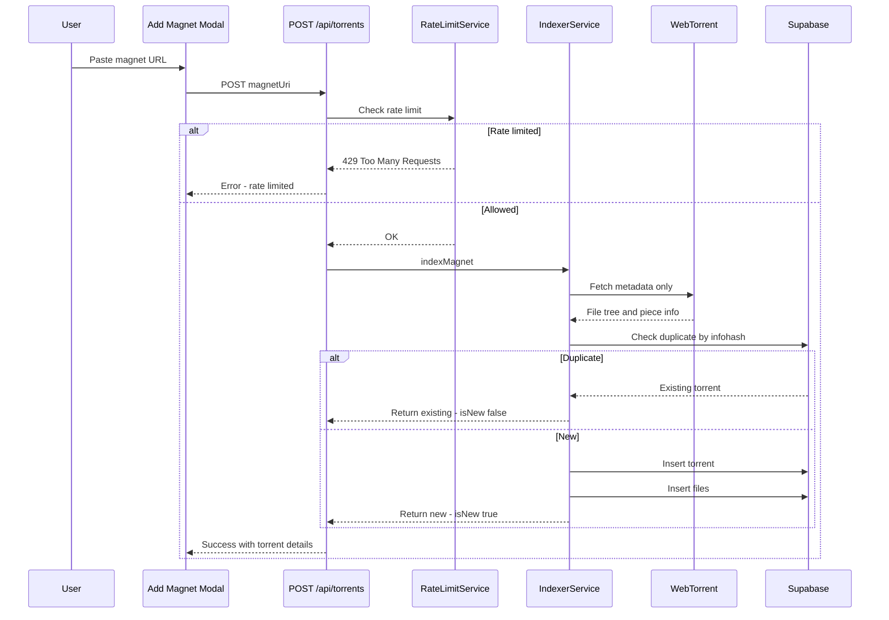
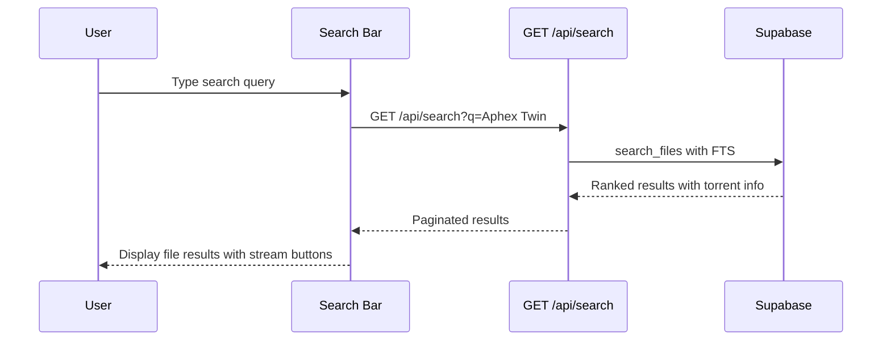

# PRD Addendum Implementation Plan

## Magnet URL Ingestion & Deep Torrent File Search

---

## Executive Summary

The PRD Addendum requirements are **largely already implemented** in the existing codebase. This document outlines the gaps and the implementation plan to achieve full compliance with the PRD Addendum.

---

## Current State Analysis

### ✅ Already Implemented

| PRD Section | Implementation | Location |
|-------------|----------------|----------|
| **16.2 Magnet Ingestion Flow** | Metadata-only fetch, no content download | [`IndexerService.indexMagnet()`](../src/lib/indexer/indexer.ts:83) |
| **16.3 Supported Inputs** | Full magnet URL parsing with base32/hex support | [`parseMagnetUri()`](../src/lib/magnet/magnet.ts:88) |
| **16.4 Validation Rules** | Invalid magnet rejection, duplicate deduplication | [`MagnetParseError`](../src/lib/magnet/magnet.ts:11), [`DuplicateTorrentError`](../src/lib/indexer/indexer.ts:29) |
| **17.1 Deep File Search** | PostgreSQL full-text search across files | [`search_files()`](../supabase/migrations/20251226102528_initial_schema.sql:264) |
| **17.2 Search Scope** | Torrent name, folder paths, file names | [`search_vector`](../supabase/migrations/20251226102528_initial_schema.sql:43) with weighted columns |
| **17.3 Indexing Strategy** | All required fields stored | [`torrent_files`](../supabase/migrations/20251226102528_initial_schema.sql:29) table |
| **17.4 Pagination** | Limit/offset with hasMore indicator | [`searchFiles()`](../src/app/api/search/route.ts:140) |
| **18.1 UI Components** | Modal, list, tree views | [`add-magnet-modal.tsx`](../src/components/torrents/add-magnet-modal.tsx), [`torrent-list.tsx`](../src/components/torrents/torrent-list.tsx), [`file-tree.tsx`](../src/components/files/file-tree.tsx) |
| **19.1 Streaming** | Piece prioritization, range requests | [`StreamingService.createStream()`](../src/lib/streaming/streaming.ts:143) |
| **19.1 Cleanup** | Auto-cleanup on stream end/error | [`closeStream()`](../src/lib/streaming/streaming.ts:272) |

### 🔧 Gaps to Address

| PRD Section | Gap | Files to Modify |
|-------------|-----|-----------------|
| **16.5 Tests** | Large metadata stress tests | `src/lib/torrent/torrent.test.ts` |
| **16.5 Tests** | Timeout/tracker failure handling | `src/lib/torrent/torrent.test.ts` |
| **17.5 Tests** | SQL injection prevention | `src/app/api/search/route.test.ts` |
| **17.5 Tests** | Large dataset query performance | `src/lib/supabase/queries.test.ts` |
| **19.2 Tests** | Concurrent stream isolation | `src/lib/streaming/streaming.test.ts` |
| **19.2 Tests** | Piece prioritization verification | `src/lib/streaming/streaming.test.ts` |
| **20.1 Rate Limiting** | Implementation logic | `src/lib/rate-limit/rate-limit.ts` (new) |
| **20.2 Tests** | Abuse simulation tests | `src/lib/rate-limit/rate-limit.test.ts` (new) |

---

## Architecture Diagram



---

## Magnet Ingestion Flow



---

## Deep File Search Flow



---

## Implementation Tasks

### Phase 15.5: PRD Addendum TDD Coverage

#### 1. Large Metadata Stress Tests
- Test indexing torrents with 10,000+ files
- Verify memory usage stays bounded
- Verify database batch insert performance

#### 2. Timeout and Tracker Failure Tests
- Test metadata fetch timeout handling
- Test graceful degradation when trackers are unreachable
- Test retry logic if implemented

#### 3. SQL Injection Prevention Tests
- Test search with malicious query strings
- Test with special characters and SQL keywords
- Verify parameterized queries are used

#### 4. Large Dataset Query Performance Tests
- Test search across millions of files
- Verify query latency stays under 150ms
- Test pagination with large offsets

#### 5. Concurrent Stream Isolation Tests
- Test multiple simultaneous streams
- Verify streams do not interfere with each other
- Test cleanup when one stream fails

#### 6. Piece Prioritization Verification Tests
- Verify only requested file pieces are downloaded
- Test that other files remain unselected
- Verify cleanup after stream ends

### Phase 27: Rate Limiting Implementation

#### 1. Create RateLimitService
- Implement sliding window rate limiting
- Use existing rate_limits table
- Support different action types

#### 2. Rate Limit Magnet Ingestion
- Limit to N magnets per IP per hour
- Return 429 with Retry-After header

#### 3. Rate Limit Stream Creation
- Limit concurrent streams per IP
- Cap total streams per user

#### 4. Abuse Prevention Tests
- Simulate rapid magnet spam
- Verify rate limits are enforced
- Test graceful degradation

---

## Test Coverage Requirements

Per PRD Section 21 - Definition of Done:

- [ ] Metadata-only ingestion verified
- [ ] File-level search tested
- [ ] Streaming tested from search results
- [ ] Cleanup verified
- [ ] No uncontrolled disk growth
- [ ] All tests pass in CI

---

## Current Test Status

```
Test Files  13 passed
Tests  298 passed
```

Target after PRD Addendum implementation: **350+ tests**

---

## Next Steps

1. **Immediate**: Implement Phase 15.5 TDD coverage tests
2. **Then**: Continue with Phase 16 - Ebook reader
3. **Later**: Phase 27 - Rate limiting implementation

---

## Strategic Notes

From PRD Section 22:

> This capability enables:
> - Spotify-scale catalogs without storage
> - Decentralized cold archive streaming
> - Massive public or private datasets
> - Near-zero hosting cost scaling

The existing architecture already supports this vision. The remaining work is primarily **hardening through comprehensive testing** and **abuse prevention**.
